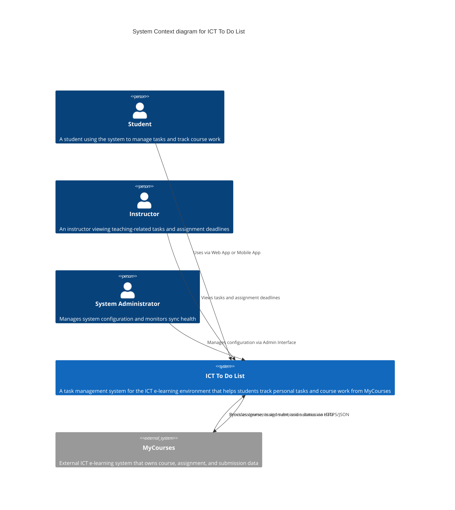

# C1 - System Context Diagram

## ICT To Do List System Context

```mermaid
C4Context
    title System Context diagram for ICT To Do List

    Person(student, "Student", "A student using the system to manage tasks and track course work")
    Person(instructor, "Instructor", "An instructor viewing teaching-related tasks and assignment deadlines")
    Person(admin, "System Administrator", "Manages system configuration and monitors sync health")
    
    System(todolist, "ICT To Do List", "A task management system for the ICT e-learning environment that helps students track personal tasks and course work from MyCourses")
    
    System_Ext(mycourses, "MyCourses", "External ICT e-learning system that owns course, assignment, and submission data")

    Rel(student, todolist, "Uses via Web App or Mobile App")
    Rel(instructor, todolist, "Views tasks and assignment deadlines")
    Rel(admin, todolist, "Manages configuration via Admin Interface")
    Rel(todolist, mycourses, "Syncs assignments and submission status via HTTPS/JSON")
    Rel(mycourses, todolist, "Provides course, assignment, and submission data")
```
