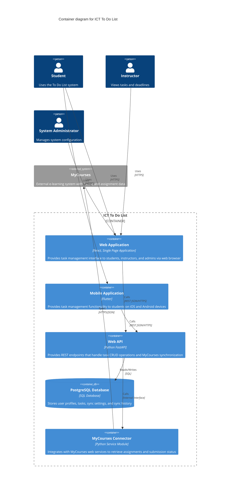

# C2 - Container Diagram

## ICT To Do List Containers

```mermaid
C4Container
    title Container diagram for ICT To Do List

    Person(student, "Student", "Uses the To Do List system")
    Person(instructor, "Instructor", "Views tasks and deadlines")
    Person(admin, "System Administrator", "Manages system configuration")
    
    System_Ext(mycourses, "MyCourses", "External e-learning system with course and assignment data")

    Container_Boundary(todolistapp, "ICT To Do List") {
        Container(webapp, "Web Application", "React, Single Page Application", "Provides task management interface to students, instructors, and admins via web browser")
        Container(mobileapp, "Mobile Application", "Flutter", "Provides task management functionality to students on iOS and Android devices")
        Container(webapi, "Web API", "Python FastAPI", "Provides REST endpoints that handle task CRUD operations and MyCourses synchronization")
        ContainerDb(database, "PostgreSQL Database", "SQL Database", "Stores user profiles, tasks, sync settings, and sync history")
        Container(mycoursesconnector, "MyCourses Connector", "Python Service Module", "Integrates with MyCourses web services to retrieve assignments and submission status")
    }

    Rel(student, webapp, "Uses", "HTTPS")
    Rel(student, mobileapp, "Uses", "HTTPS")
    Rel(instructor, webapp, "Uses", "HTTPS")
    Rel(admin, webapp, "Uses", "HTTPS")
    
    Rel(webapp, webapi, "Calls", "REST JSON/HTTPS")
    Rel(mobileapp, webapi, "Calls", "REST JSON/HTTPS")
    Rel(webapi, database, "Reads/Writes", "SQL")
    Rel(webapi, mycoursesconnector, "Calls", "Internal Interface")
    Rel(mycoursesconnector, mycourses, "Syncs", "HTTPS/JSON")

    UpdateRelStyle(student, webapp, $offsetY="60", $offsetX="90")
    UpdateRelStyle(student, mobileapp, $offsetY="-30")
    UpdateRelStyle(instructor, webapp, $offsetX="40", $offsetY="40")
    UpdateRelStyle(admin, webapp, $offsetX="-40", $offsetY="-40")
```
