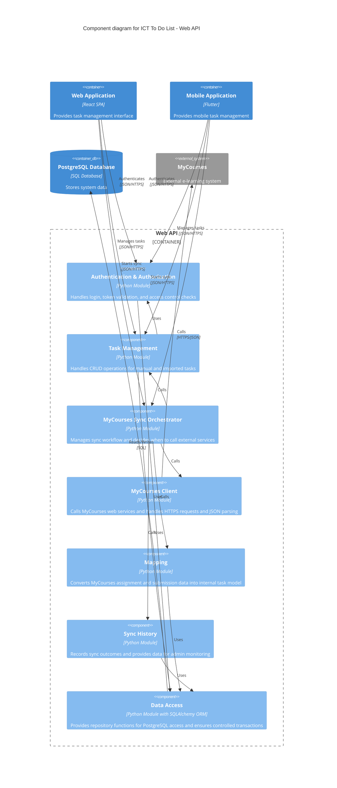

# C3 - Component Diagram

## ICT To Do List Web API Components

```mermaid
C4Component
    title Component diagram for ICT To Do List - Web API

    Container(webapp, "Web Application", "React SPA", "Provides task management interface")
    Container(mobileapp, "Mobile Application", "Flutter", "Provides mobile task management")
    ContainerDb(db, "PostgreSQL Database", "SQL Database", "Stores system data")
    System_Ext(mycourses, "MyCourses", "External e-learning system")

    Container_Boundary(webapi, "Web API") {
        Component(auth, "Authentication & Authorization", "Python Module", "Handles login, token validation, and access control checks")
        Component(taskmanagement, "Task Management", "Python Module", "Handles CRUD operations for manual and imported tasks")
        Component(syncorchestrator, "MyCourses Sync Orchestrator", "Python Module", "Manages sync workflow and decides when to call external services")
        Component(mycoursesoauth, "MyCourses Client", "Python Module", "Calls MyCourses web services and handles HTTPS requests and JSON parsing")
        Component(mapping, "Mapping", "Python Module", "Converts MyCourses assignment and submission data into internal task model")
        Component(synchistory, "Sync History", "Python Module", "Records sync outcomes and provides data for admin monitoring")
        Component(dataaccess, "Data Access", "Python Module with SQLAlchemy ORM", "Provides repository functions for PostgreSQL access and ensures controlled transactions")

        Rel(auth, dataaccess, "Uses")
        Rel(taskmanagement, dataaccess, "Uses")
        Rel(taskmanagement, auth, "Uses")
        Rel(syncorchestrator, taskmanagement, "Calls")
        Rel(syncorchestrator, mycoursesoauth, "Calls")
        Rel(syncorchestrator, mapping, "Calls")
        Rel(syncorchestrator, synchistory, "Calls")
        Rel(mycoursesoauth, mycourses, "Calls", "HTTPS/JSON")
        Rel(mapping, dataaccess, "Uses")
        Rel(synchistory, dataaccess, "Uses")
        Rel(dataaccess, db, "Reads/Writes", "SQL")
    }

    Rel(webapp, auth, "Authenticates", "JSON/HTTPS")
    Rel(webapp, taskmanagement, "Manages tasks", "JSON/HTTPS")
    Rel(webapp, syncorchestrator, "Starts sync", "JSON/HTTPS")
    
    Rel(mobileapp, auth, "Authenticates", "JSON/HTTPS")
    Rel(mobileapp, taskmanagement, "Manages tasks", "JSON/HTTPS")
    Rel(mobileapp, syncorchestrator, "Starts sync", "JSON/HTTPS")

    UpdateRelStyle(webapp, auth, $offsetY="-40")
    UpdateRelStyle(webapp, taskmanagement, $offsetY="40")
    UpdateRelStyle(mobileapp, auth, $offsetX="-90", $offsetY="-40")
    UpdateRelStyle(mobileapp, syncorchestrator, $offsetX="-90", $offsetY="40")
```
