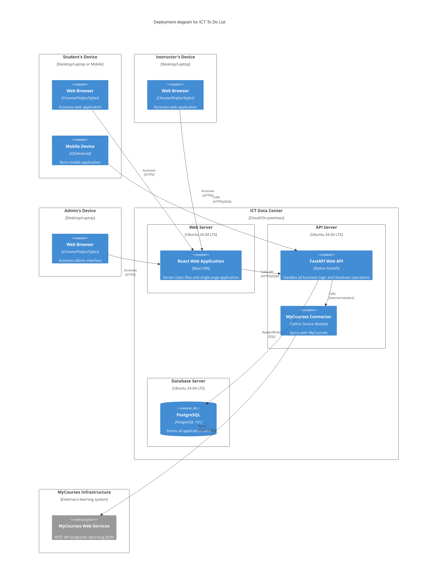

# C4 - Deployment Diagram

## ICT To Do List Deployment

```mermaid
C4Deployment
    title Deployment diagram for ICT To Do List

    Deployment_Node(studentdevice, "Student's Device", "Desktop/Laptop or Mobile") {
        Container(studentweb, "Web Browser", "Chrome/Firefox/Safari", "Accesses web application")
        Container(studentmobile, "Mobile Device", "iOS/Android", "Runs mobile application")
    }

    Deployment_Node(instructordevice, "Instructor's Device", "Desktop/Laptop") {
        Container(instructorweb, "Web Browser", "Chrome/Firefox/Safari", "Accesses web application")
    }

    Deployment_Node(admindevice, "Admin's Device", "Desktop/Laptop") {
        Container(adminweb, "Web Browser", "Chrome/Firefox/Safari", "Accesses admin interface")
    }

    Deployment_Node(ictdatacenter, "ICT Data Center", "Cloud/On-premises") {
        Deployment_Node(webserver, "Web Server", "Ubuntu 24.04 LTS") {
            Container(reactapp, "React Web Application", "React SPA", "Serves static files and single page application")
        }
        
        Deployment_Node(apiserver, "API Server", "Ubuntu 24.04 LTS") {
            Container(fastapi, "FastAPI Web API", "Python FastAPI", "Handles all business logic and database operations")
            Container(mycoursesmod, "MyCourses Connector", "Python Service Module", "Syncs with MyCourses")
        }
        
        Deployment_Node(dbserver, "Database Server", "Ubuntu 24.04 LTS") {
            ContainerDb(postgres, "PostgreSQL", "PostgreSQL 15+", "Stores all application data")
        }
    }

    Deployment_Node(myroutersdc, "MyCourses Infrastructure", "External e-learning system") {
        System_Ext(mycourses_ext, "MyCourses Web Services", "REST API endpoints returning JSON")
    }

    Rel(studentweb, reactapp, "Accesses", "HTTPS")
    Rel(studentmobile, fastapi, "Calls", "HTTPS/JSON")
    Rel(instructorweb, reactapp, "Accesses", "HTTPS")
    Rel(adminweb, reactapp, "Accesses", "HTTPS")
    
    Rel(reactapp, fastapi, "Calls API", "HTTPS/JSON")
    Rel(fastapi, postgres, "Reads/Writes", "SQL")
    Rel(fastapi, mycoursesmod, "Calls", "Internal Interface")
    Rel(mycoursesmod, mycourses_ext, "Syncs", "HTTPS/JSON")

    UpdateRelStyle(studentweb, reactapp, $offsetY="-40")
    UpdateRelStyle(studentmobile, fastapi, $offsetX="40", $offsetY="-40")
    UpdateRelStyle(instructorweb, reactapp, $offsetX="40", $offsetY="40")
    UpdateRelStyle(adminweb, reactapp, $offsetX="-40", $offsetY="40")
    UpdateRelStyle(fastapi, postgres, $offsetY="-40")
```
